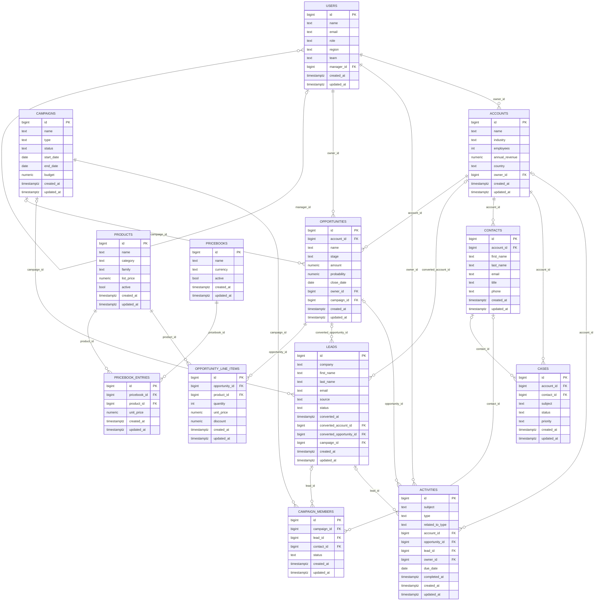

<!-- AUTO-GENERATED by tools/generate_erd.py. Do not hand-edit; rerun the script. -->

# CRM Schema Reference

Generated `2026-04-25 09:36 UTC` from schema `public`. Regenerate with:

```bash
uv run python tools/generate_erd.py
```

The Mermaid block below renders directly in GitHub. To export to PNG/SVG,
install [`@mermaid-js/mermaid-cli`](https://github.com/mermaid-js/mermaid-cli)
and run `mmdc -i docs/erd.md -o docs/erd.svg`.

## Entity-relationship diagram



Reading the diagram: `||` means *exactly one*, `|o` means *zero or one*
(the FK column is nullable), `o{` means *zero or many*. The labels on each
edge are the FK column on the child table.

## Tables (13)

### `accounts`

| Column | Type | Nullable | Notes |
| --- | --- | --- | --- |
| `id` | bigint | NO | PK |
| `name` | text | NO | — |
| `industry` | text | NO | — |
| `employees` | int | NO | — |
| `annual_revenue` | numeric | NO | — |
| `country` | text | NO | — |
| `owner_id` | bigint | NO | FK → `users.id` |
| `created_at` | timestamptz | NO | — |
| `updated_at` | timestamptz | NO | — |

### `activities`

| Column | Type | Nullable | Notes |
| --- | --- | --- | --- |
| `id` | bigint | NO | PK |
| `subject` | text | NO | — |
| `type` | text | NO | — |
| `related_to_type` | text | NO | — |
| `account_id` | bigint | YES | FK → `accounts.id` |
| `opportunity_id` | bigint | YES | FK → `opportunities.id` |
| `lead_id` | bigint | YES | FK → `leads.id` |
| `owner_id` | bigint | NO | FK → `users.id` |
| `due_date` | date | YES | — |
| `completed_at` | timestamptz | YES | — |
| `created_at` | timestamptz | NO | — |
| `updated_at` | timestamptz | NO | — |

### `campaign_members`

| Column | Type | Nullable | Notes |
| --- | --- | --- | --- |
| `id` | bigint | NO | PK |
| `campaign_id` | bigint | NO | FK → `campaigns.id` |
| `lead_id` | bigint | YES | FK → `leads.id` |
| `contact_id` | bigint | YES | FK → `contacts.id` |
| `status` | text | NO | — |
| `created_at` | timestamptz | NO | — |
| `updated_at` | timestamptz | NO | — |

Unique constraints / indexes:
- `CREATE UNIQUE INDEX uq_cm_campaign_contact ON public.campaign_members USING btree (campaign_id, contact_id) WHERE (contact_id IS NOT NULL)`
- `CREATE UNIQUE INDEX uq_cm_campaign_lead ON public.campaign_members USING btree (campaign_id, lead_id) WHERE (lead_id IS NOT NULL)`

### `campaigns`

| Column | Type | Nullable | Notes |
| --- | --- | --- | --- |
| `id` | bigint | NO | PK |
| `name` | text | NO | — |
| `type` | text | NO | — |
| `status` | text | NO | — |
| `start_date` | date | NO | — |
| `end_date` | date | NO | — |
| `budget` | numeric | NO | — |
| `created_at` | timestamptz | NO | — |
| `updated_at` | timestamptz | NO | — |

### `cases`

| Column | Type | Nullable | Notes |
| --- | --- | --- | --- |
| `id` | bigint | NO | PK |
| `account_id` | bigint | NO | FK → `accounts.id` |
| `contact_id` | bigint | YES | FK → `contacts.id` |
| `subject` | text | NO | — |
| `status` | text | NO | — |
| `priority` | text | NO | — |
| `created_at` | timestamptz | NO | — |
| `updated_at` | timestamptz | NO | — |

### `contacts`

| Column | Type | Nullable | Notes |
| --- | --- | --- | --- |
| `id` | bigint | NO | PK |
| `account_id` | bigint | NO | FK → `accounts.id` |
| `first_name` | text | NO | — |
| `last_name` | text | NO | — |
| `email` | text | NO | — |
| `title` | text | NO | — |
| `phone` | text | YES | — |
| `created_at` | timestamptz | NO | — |
| `updated_at` | timestamptz | NO | — |

Unique constraints / indexes:
- `CREATE UNIQUE INDEX contacts_email_key ON public.contacts USING btree (email)`

### `leads`

| Column | Type | Nullable | Notes |
| --- | --- | --- | --- |
| `id` | bigint | NO | PK |
| `company` | text | NO | — |
| `first_name` | text | NO | — |
| `last_name` | text | NO | — |
| `email` | text | NO | — |
| `source` | text | NO | — |
| `status` | text | NO | — |
| `converted_at` | timestamptz | YES | — |
| `converted_account_id` | bigint | YES | FK → `accounts.id` |
| `converted_opportunity_id` | bigint | YES | FK → `opportunities.id` |
| `campaign_id` | bigint | YES | FK → `campaigns.id` |
| `created_at` | timestamptz | NO | — |
| `updated_at` | timestamptz | NO | — |

Unique constraints / indexes:
- `CREATE UNIQUE INDEX leads_email_key ON public.leads USING btree (email)`

### `opportunities`

| Column | Type | Nullable | Notes |
| --- | --- | --- | --- |
| `id` | bigint | NO | PK |
| `account_id` | bigint | NO | FK → `accounts.id` |
| `name` | text | NO | — |
| `stage` | text | NO | — |
| `amount` | numeric | NO | — |
| `probability` | numeric | NO | — |
| `close_date` | date | NO | — |
| `owner_id` | bigint | NO | FK → `users.id` |
| `campaign_id` | bigint | YES | FK → `campaigns.id` |
| `created_at` | timestamptz | NO | — |
| `updated_at` | timestamptz | NO | — |

### `opportunity_line_items`

| Column | Type | Nullable | Notes |
| --- | --- | --- | --- |
| `id` | bigint | NO | PK |
| `opportunity_id` | bigint | NO | FK → `opportunities.id` |
| `product_id` | bigint | NO | FK → `products.id` |
| `quantity` | int | NO | — |
| `unit_price` | numeric | NO | — |
| `discount` | numeric | NO | — |
| `created_at` | timestamptz | NO | — |
| `updated_at` | timestamptz | NO | — |

Unique constraints / indexes:
- `CREATE UNIQUE INDEX opportunity_line_items_opportunity_id_product_id_key ON public.opportunity_line_items USING btree (opportunity_id, product_id)`

### `pricebook_entries`

| Column | Type | Nullable | Notes |
| --- | --- | --- | --- |
| `id` | bigint | NO | PK |
| `pricebook_id` | bigint | NO | FK → `pricebooks.id` |
| `product_id` | bigint | NO | FK → `products.id` |
| `unit_price` | numeric | NO | — |
| `created_at` | timestamptz | NO | — |
| `updated_at` | timestamptz | NO | — |

Unique constraints / indexes:
- `CREATE UNIQUE INDEX pricebook_entries_pricebook_id_product_id_key ON public.pricebook_entries USING btree (pricebook_id, product_id)`

### `pricebooks`

| Column | Type | Nullable | Notes |
| --- | --- | --- | --- |
| `id` | bigint | NO | PK |
| `name` | text | NO | — |
| `currency` | text | NO | — |
| `active` | bool | NO | — |
| `created_at` | timestamptz | NO | — |
| `updated_at` | timestamptz | NO | — |

Unique constraints / indexes:
- `CREATE UNIQUE INDEX pricebooks_name_key ON public.pricebooks USING btree (name)`

### `products`

| Column | Type | Nullable | Notes |
| --- | --- | --- | --- |
| `id` | bigint | NO | PK |
| `name` | text | NO | — |
| `category` | text | NO | — |
| `family` | text | NO | — |
| `list_price` | numeric | NO | — |
| `active` | bool | NO | — |
| `created_at` | timestamptz | NO | — |
| `updated_at` | timestamptz | NO | — |

### `users`

| Column | Type | Nullable | Notes |
| --- | --- | --- | --- |
| `id` | bigint | NO | PK |
| `name` | text | NO | — |
| `email` | text | NO | — |
| `role` | text | NO | — |
| `region` | text | NO | — |
| `team` | text | NO | — |
| `manager_id` | bigint | YES | FK → `users.id` |
| `created_at` | timestamptz | NO | — |
| `updated_at` | timestamptz | NO | — |

Unique constraints / indexes:
- `CREATE UNIQUE INDEX users_email_key ON public.users USING btree (email)`


## Views (3)

- `account_all_activities`
- `lead_activities`
- `opportunity_activities`

These views wrap the polymorphic `activities` table; prefer them over
filtering on `related_to_type` directly. See the README's "Convenience
views" section.
